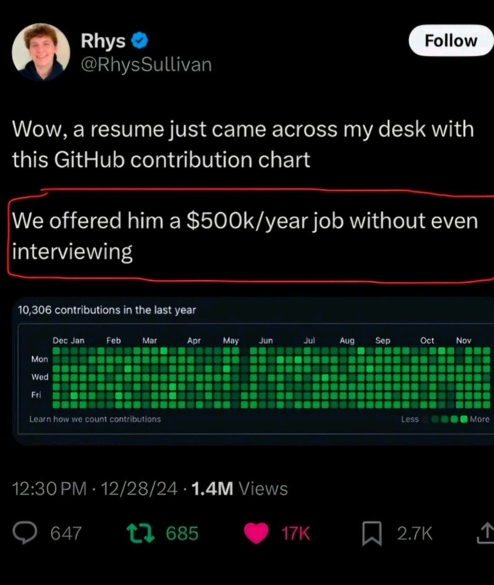

# Bitcoin Price Updater

### 🚨 **Current Bitcoin Price**: **💰 $117,711.00 USD** 💰
_Last updated on 2025-08-16 12:36:10 UTC_

---

This repository automatically fetches the current Bitcoin (BTC) price every day and updates the `README.md` file with the latest price, along with the date and time of the update.
The updates are done using a Python script that retrieves the price from the CoinGecko API and commits the changes to the repository, ensuring that the `README.md` always reflects the latest BTC price.

### Features:
- Daily updates of Bitcoin price in USD.
- Automatically updates the `README.md` file with the current date, time (UTC), and price.
- Powered by Python and GitHub Actions.
- Uses the CoinGecko API for fetching real-time Bitcoin prices.

### How it works:
1. A scheduled GitHub Actions workflow runs daily.
2. The workflow triggers a Python script that fetches the latest Bitcoin price from the CoinGecko API.
3. The script updates the `README.md` file with the price, date, and time.
4. The changes are automatically committed and pushed to the repository.

### Motivation:
This project is a fun way to automate the process of keeping track of Bitcoin's price and share it with the GitHub community.
Perfect for crypto enthusiasts and developers who want to keep their contribution graph active with daily commits!

### Inspiration:
This project was inspired by a post on X (formerly Twitter) where a developer who made a large number of daily commits on GitHub for a year was hired with no interview needed for a $500k/year job.
Inspired by this post, I wanted to automate a way to achieve this while also providing useful, real-time information about Bitcoin prices.
Now, I have both a fun contribution graph and up-to-date crypto price data every day!
This project highlights that GitHub contribution stats alone do not always accurately reflect a developer’s true value or technical expertise.

---

---
